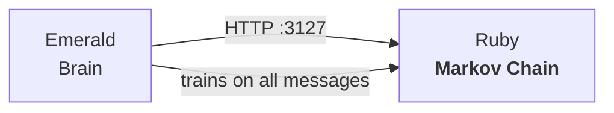

<p align="center">
  <picture>
    <source media="(prefers-color-scheme: dark)" srcset="images/logo.webp">
    
  </picture>
  <h1 align="center">Ruby</h1>
  <p align="center">Markov chain service for the Luna Protocol ecosystem</p>
  <p align="center">
    <a href="https://github.com/protocol-luna/ruby/blob/main/LICENSE">
      
    </a>
    <a href="https://www.typescriptlang.org/">
      
    </a>
    <a href="https://github.com/sql-js/sql.js/">
      
    </a>
    <a href="https://github.com/protocol-luna">
      
    </a>
  </p>
</p>

Ruby generates spontaneous, context-free messages by recombining real messages from Discord and Matrix channels — no LLM inference needed.



## How It Works

1. Every message that flows through Emerald is forwarded to Ruby's `/train` endpoint (fire-and-forget)
2. Ruby tokenizes and builds an order-2 Markov chain in SQLite: each pair of words maps to possible next words
3. Messages are tagged with `channel_id`, `user_id`, `platform` — the chain can be filtered by source
4. When Emerald decides to be spontaneous, it calls Ruby's `/generate`
5. Ruby samples the chain with weighted random selection and returns a sentence
6. Emerald applies the same behavior pipeline as any response (delay, hesitation, burst, typos)

## Components

- **`src/chain.ts`** — Core Markov chain (SQLite via sql.js)
- **`src/server.ts`** — HTTP server: `POST /train`, `POST /generate`, `GET /channels`, `GET /stats`, `GET /health`
- **`src/config.ts`** — YAML-based configuration
- **`tools/backfill.ts`** — Discord backfill: iterates all accessible text channels via REST API

## API

### `POST /train`

Feed a message into the chain.

```json
{ "text": "hello everyone how are you", "channel_id": "123", "user_id": "456", "platform": "discord" }
```

### `POST /generate`

Generate a message from the chain. Optional `channel_id` to filter by source channel.

```json
{ "seed": "how", "max_length": 30, "channel_id": "123" }
```

Returns `{ "text": "how are you doing today" }`.

### `GET /channels`

Returns list of all known channel IDs: `{ "channels": ["123", "456"] }`.

### `GET /stats`

Returns chain statistics: `{ transitions, starts }`.

## Configuration

```yaml
port: 3127
host: "127.0.0.1"
order: 2
max_length: 30
skip_dm: true
save_interval_ms: 60000
db_path: "chain.db"
```

## Running

```bash
npm install
npm run build    # esbuild → self-cli.cjs
npm run start    # node self-cli.cjs
npm run dev      # tsx watch
```

With PM2:

```bash
pm2 start self-cli.cjs --interpreter node --name ruby
pm2 save
```

## Discord Backfill

To train Ruby on existing message history:

```bash
npx tsx tools/backfill.ts --jade-config ../jade/config.yml
```

The script is resumable — it saves a `backfill-checkpoint.json` with the last message ID per channel.

## Integration with Emerald

Ruby is wired into Emerald via `emerald/src/ruby-client.ts`. When `ruby_enabled: true` in Emerald's config, every message is silently trained into Ruby, and triggers with reasons in `ruby_reasons` use Ruby instead of Sapphire/LLM.
