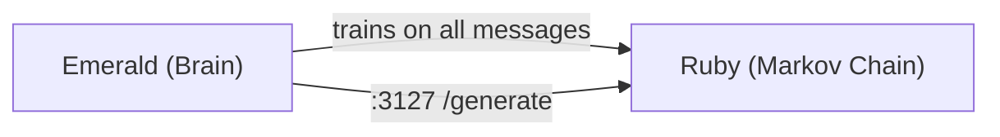

<p align="center">
  <picture>
    <source media="(prefers-color-scheme: dark)" srcset="images/logo.webp">
    
  </picture>
  <h1 align="center">Ruby</h1>
  <p align="center">Markov chain service for the Luna Protocol ecosystem</p>
  <p align="center">
    <a href="https://github.com/protocol-luna/ruby/blob/main/LICENSE">
      
    </a>
    <a href="https://www.typescriptlang.org/">
      
    </a>
    <a href="https://github.com/protocol-luna">
      
    </a>
    <a href="https://huggingface.co/fox3000foxy/ruby-chain">
      
    </a>
  </p>
</p>

Ruby generates spontaneous, context-free messages by recombining real messages from Discord and Matrix channels — no LLM inference needed. It's an order-4 Markov chain stored in SQLite.

Pre-trained chains (orders 2, 3, 4) are available on [HuggingFace](https://huggingface.co/fox3000foxy/ruby-chain), trained on 16.9M real Discord messages.



## How It Works

1. Every message that flows through Emerald is forwarded to Ruby's `/train` endpoint (fire-and-forget)
2. Ruby tokenizes and builds an order-4 Markov chain in SQLite: each 4-word prefix maps to possible next words
3. Messages are tagged with `channel_id` — the chain can be filtered by source channel or topic
4. When Emerald decides to be spontaneous (or triggers a `random`/`spontaneous` response), it calls Ruby's `/generate`
5. Ruby samples the chain with weighted random selection and returns a sentence
6. Emerald applies the same behavior pipeline as any response (delay, hesitation, burst, typos)

## Technical Overview

Ruby is **~400 lines of TypeScript** across 4 source files. It uses **better-sqlite3** (native SQLite binding) for persistence and Node.js built-in `http` module for the server — no external HTTP framework.

### Source Map

| File | Lines | Role |
|------|-------|------|
| `src/index.ts` | 27 | Entry point, signal handlers |
| `src/config.ts` | 39 | YAML config loader |
| `src/chain.ts` | 224 | Core Markov chain + SQLite |
| `src/server.ts` | 131 | HTTP server (6 endpoints) |
| `tools/train-multi.js` | 214 | Multi-worker bulk trainer (direct, no HTTP) |
| `tools/train-merge.cjs` | 54 | Merge worker DBs via ATTACH + SUM |
| `tools/prepare.py` | 117 | Parallel ChatML extraction from HF dataset |
| `tools/download-chain.cjs` | 85 | Download pre-trained chain from HuggingFace |
| `tools/generate.cjs` | 63 | CLI generator with seed support + fallback |
| `tools/trace.cjs` | 49 | Trace forward path of a generated sentence |
| `tools/reverse.cjs` | 39 | Reverse lookup: find prefixes that produce a word |
| `tools/bench.cjs` | 123 | Direct benchmark (no HTTP overhead) |

### Markov Chain Implementation (`src/chain.ts`, 225 lines)

**Database schema:**

```sql
-- Prefix→suffix mapping (order is configurable, default 4)
CREATE TABLE transitions (
  prefix TEXT,       -- N words joined by \x00, e.g. "hello\x00world\x00how\x00are"
  suffix TEXT,       -- the next word
  count INTEGER,     -- frequency (incremented on repeat)
  channel_id TEXT,   -- source channel or topic tag
  PRIMARY KEY (prefix, suffix, channel_id)
);

-- Valid sentence starters
CREATE TABLE starters (
  prefix TEXT,       -- first N words of a message
  channel_id TEXT,
  PRIMARY KEY (prefix, channel_id)
);

CREATE INDEX idx_trans_prefix ON transitions(prefix);
```

**Training (`train()`):**
1. Tokenizes text: strips URLs, Discord mentions (`<@!?\d+>`), custom emoji, non-word characters. Splits on whitespace.
2. Requires ≥order+1 words
3. First `order` words → inserted into `starters` (INSERT OR IGNORE)
4. Each sliding window of `order` words → next word inserted/summed into `transitions` (upsert pattern)

**Generation (`generate()`):**
1. Pick a starting prefix: random from `starters`, or filtered by `seed` (LIKE match on lowercased seed + `%`)
2. Start with the first `order` words
3. Loop up to `maxLength` (default 30):
   - Query `transitions` for all suffixes matching current `order`-word prefix
   - **Weighted random selection:** sum all counts, roll in `[0, total)`, subtract each count until roll hits zero
   - If no transition found, stop
   - Append suffix to result, slide window
4. Return joined words

**Persistence:** better-sqlite3 writes directly to disk (WAL mode). No periodic save needed — every `train()` call is immediately durable. A `VACUUM` runs every 500K transitions to reclaim space.

### API Endpoints

#### `POST /train`
Train a single message.
```json
{ "text": "hello everyone how are you", "channel_id": "123", "isDM": false }
```
Response: `200 { "trained": true }`

#### `POST /train-batch`
Train multiple messages atomically (SQL transaction).
```json
{ "messages": [{ "text": "...", "channel_id": "..." }, ...] }
```
Response: `200 { "trained": <count> }`

#### `POST /generate`
Generate a message. All fields optional.
```json
{ "seed": "how", "max_length": 30, "channel_id": "123" }
```
Response: `200 { "text": "how are you doing today" }`

#### `GET /channels`
List all known channel IDs.
Response: `200 { "channels": ["123", "456"] }`

#### `GET /stats`
Chain statistics.
Response: `200 { "transitions": 423, "starts": 87 }`

#### `GET /health`
Health check.
Response: `200 { "status": "ok" }`

### Tokenization (`tokenize()`)

```typescript
1. Strip URLs: https?://\S+
2. Strip Discord mentions: <@!?\d+>
3. Strip custom emoji: <a?:\w+:\d+>
4. Strip non-word/accented chars (keep a-z, A-Z, 0-9, _, whitespace, apostrophes)
5. Split on whitespace, filter empty
```

### Configuration

```yaml
port: 3127
host: "127.0.0.1"
order: 4          # Markov chain order (2, 3, or 4)
max_length: 30    # Max generated words
skip_dm: true     # Skip DM messages in training
db_path: "chain.db"
```

## Pre-trained Chains

Pre-trained Markov chains are available on [HuggingFace](https://huggingface.co/fox3000foxy/ruby-chain):

| File | Order | Transitions | Starters | Size | Quality |
|------|-------|-------------|----------|------|---------|
| `chain-order2.db` | 2 | 18.9M | 615K | 1.1 GB | Creative but less coherent |
| `chain-order3.db` | 3 | 6.8M | 788K | 626 MB | Good balance |
| `chain-order4.db` | 4 | 6.9M | 1.1M | 747 MB | Most coherent (recommended) |

Training data: 16.9M human messages from [mookiezi/Discord-Dialogues](https://huggingface.co/datasets/mookiezi/Discord-Dialogues).

```bash
# Download latest (order 4)
npm run download-chain

# Or pick a specific order
npm run download-chain:order2
npm run download-chain:order3
npm run download-chain:order4
```

Uses `hf download` if available, falls back to HTTPS download with progress bar.

### Integration with Emerald

Ruby is wired via `emerald/src/ruby-client.ts`:
- **Training:** Every non-self message Emerald sees → fire-and-forget `POST /train`
- **Generation:** When trigger reason matches `ruby_reasons` config (default: `["random", "spontaneous"]`), Emerald generates via Ruby instead of Sapphire/LLM
- **Seed:** The last 2 words of the user's message are used as the generation seed
- **Post-processing:** Ruby output goes through Emerald's full behavior pipeline (delay, hesitation, burst, typos)

This gives the bot occasional "ambient" messages at near-zero latency compared to LLM inference.

### Bulk Training from HuggingFace

```bash
# 1. Extract messages (4 workers, parallel)
pip install datasets
python tools/prepare.py

# 2. Train multi-worker (4 workers, ~300K msgs/s)
node tools/train-multi.js
```

Downloads and processes `mookiezi/Discord-Dialogues` dataset directly with better-sqlite3 — no HTTP overhead.

## Command-line Tools

```bash
# Generate a random sentence
node tools/generate.cjs

# Generate with a seed
node tools/generate.cjs "how are you"

# Trace how a generated sentence was built step by step
node tools/trace.cjs <sentence>

# Reverse lookup: find which 4-word prefixes produce a given word
node tools/reverse.cjs <word>

# Benchmark training + generation throughput
node tools/bench.cjs
```

### `generate.cjs`

Generates a sentence from the command line. Optional seed: if the seed matches a known starter, it's used; otherwise it's prepended to a random sentence.

### `trace.cjs`

Shows each step of a generated sentence — for each word, what prefix generated it, the chosen suffix, and all other available options with their counts. Useful for understanding why the chain made a particular choice.

### `reverse.cjs`

Given a suffix word, scans the chain to find all prefixes (ORDER words) that produce it in the training data, sorted by frequency. The inverse of the normal generation direction.

## Running

```bash
npm install
npm run build    # esbuild → self-cli.cjs
npm run start    # node self-cli.cjs
npm run dev      # tsx watch

# With PM2
pm2 start self-cli.cjs --interpreter node --name ruby
pm2 save
```
